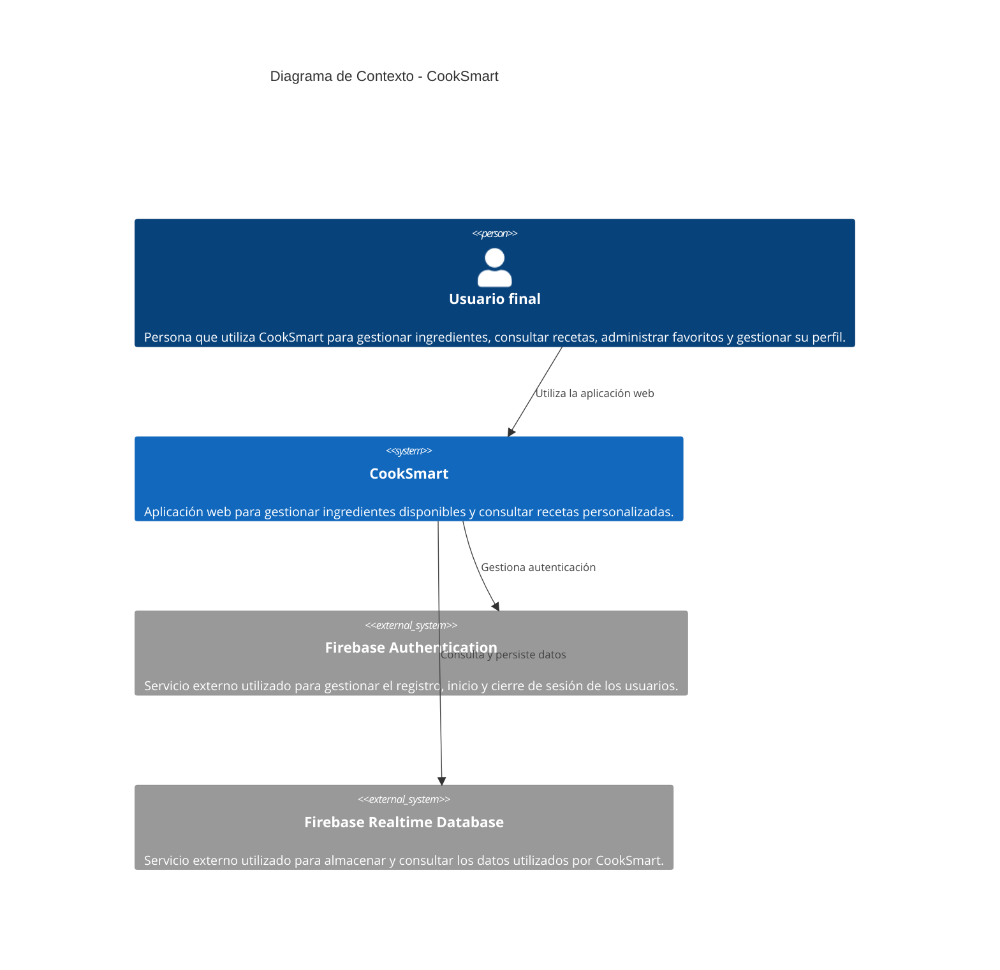

# C4 - Diagrama de Contexto de CookSmart

## 1. Propósito de la vista

Esta vista representa el contexto actual de CookSmart, identificando el sistema, sus usuarios y los sistemas externos con los que interactúa.

La vista corresponde a la arquitectura real implementada y no incluye componentes de la arquitectura propuesta como trabajo futuro.

## 2. Audiencia

* Profesor y evaluadores del curso de Arquitectura de Software.
* Integrantes del equipo de desarrollo.
* Personas que necesiten comprender los límites del sistema sin revisar el código.

## 3. Sistema

### CookSmart

Aplicación web que permite a los usuarios gestionar los ingredientes disponibles en su nevera y consultar recetas personalizadas de acuerdo con dichos ingredientes.

La implementación actual utiliza HTML, CSS y JavaScript en el lado del cliente.

## 4. Personas

### Usuario final

Persona que utiliza CookSmart para:

* Registrarse e iniciar sesión.
* Gestionar los ingredientes disponibles en su nevera.
* Consultar recetas.
* Filtrar recetas por categorías.
* Consultar su perfil.
* Gestionar sus recetas favoritas.

## 5. Sistemas externos

### Firebase Authentication

Servicio externo utilizado por CookSmart para gestionar la autenticación de los usuarios.

### Firebase Realtime Database

Servicio externo utilizado por CookSmart para la persistencia y consulta de los datos utilizados por la aplicación.

## 6. Diagrama C4 de Contexto

### Descripción del diagrama

El diagrama representa a **CookSmart** como el sistema principal y muestra sus principales relaciones externas.

El **Usuario final** interactúa directamente con CookSmart para utilizar las funcionalidades disponibles en la aplicación.

CookSmart se comunica con **Firebase Authentication** para gestionar el registro, inicio y cierre de sesión de los usuarios.

CookSmart también se comunica con **Firebase Realtime Database** para consultar y persistir la información utilizada por la aplicación.

## 7. Relaciones

| Origen        | Destino                    | Relación                                     |
| ------------- | -------------------------- | -------------------------------------------- |
| Usuario final | CookSmart                  | Utiliza la aplicación web                    |
| CookSmart     | Firebase Authentication    | Gestiona registro, inicio y cierre de sesión |
| CookSmart     | Firebase Realtime Database | Consulta y persiste información del sistema  |

## 8. Límites del sistema

El sistema evaluado corresponde a la implementación actualmente disponible en el repositorio.

Incluye:

* HTML
* CSS
* JavaScript
* Firebase Authentication
* Firebase Realtime Database

No se consideran parte del sistema actual:

* API Gateway
* Microservicios
* MySQL/PostgreSQL
* Redis
* Motor de IA/Claude

Estos elementos corresponden a una arquitectura propuesta o de trabajo futuro y no forman parte de la arquitectura actualmente implementada.

## 9. Validación contra el código

El contexto fue construido a partir de la implementación real del repositorio.

La existencia de Firebase Authentication y Firebase Realtime Database se evidencia mediante los archivos `firebase-sync.js` y `recetas-db.js`.

Las interfaces principales del sistema están implementadas mediante archivos HTML, CSS y JavaScript ubicados en la raíz del repositorio.

## 10. Decisiones y correcciones

El diagrama representa únicamente la arquitectura **as-is**. Se excluyeron los elementos de la arquitectura propuesta inicialmente que no tienen una implementación correspondiente en el repositorio actual.

Esta corrección evita representar como arquitectura existente componentes que pertenecen al roadmap o trabajo futuro.
