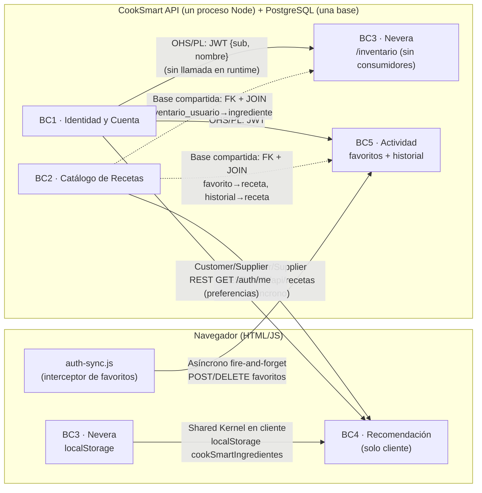

# Context Map — CookSmart (Módulo 5, Semana 9)

> Construido **después** de decidir los contextos en `docs/dominio/mapa-dominio.md` §6.
> Regla aplicada: **cada flecha debe poder señalarse en el código**. Las relaciones sin evidencia se listan aparte como *hipotéticas*.
>
> Diferencia con el C4 (`docs/06-c4-contenedores.md`, `docs/07-c4-componentes.md`): el C4 muestra **contenedores y capas técnicas** (Web → API → PostgreSQL, routes → controllers → services → repositories). Este mapa muestra **fronteras de modelo** y **cómo se acoplan**, que en CookSmart cruzan los contenedores (BC3 y BC4 viven parcialmente en el navegador).

---

## 1. Contextos

| Contexto | Responsabilidad | Dónde vive hoy | Evidencia |
|---|---|---|---|
| BC1 · Identidad y Cuenta | Credenciales, JWT, perfil, preferencias | API | `auth.*`, `authMiddleware.js`, tabla `usuario` |
| BC2 · Catálogo de Recetas | Recetas + datos maestros (ingredientes, categorías, tipos de cocina) | API | `recetas.*`, `catalogos.*` |
| BC3 · Nevera | Inventario personal con vencimiento | **API (sin uso) + navegador (en uso)** | `inventario.*`; `mi-nevera.html` (`localStorage.cookSmartNevera`) |
| BC4 · Recomendación | Coincidencia ingredientes ↔ recetas, "vence pronto" | **Solo navegador** | `recetas.html` (`matchReal`), `mi-nevera.html` |
| BC5 · Actividad del Usuario | Favoritos e historial | API + sincronización desde el navegador | `favoritos.*`, `historial.*`, `auth-sync.js` |

## 2. Diagrama



Leyenda: línea continua = integración a través de una interfaz (HTTP, token, almacenamiento del cliente). Línea punteada = acoplamiento **por base de datos compartida** (no pasa por una API del contexto proveedor).

## 3. Relaciones (con evidencia)

| # | Origen (upstream) | Destino (downstream) | Patrón | Información | Mecanismo | Evidencia | Estado |
|---|---|---|---|---|---|---|---|
| E1 | BC1 | BC3, BC5 | **Open Host Service / Published Language** | `id_usuario` (claim `sub`) | JWT firmado HS256; verificación **local** con `JWT_SECRET` (no hay llamada a BC1) | `authMiddleware.js` `requireAuth` + `soloElMismoUsuario` | Confirmada |
| E2 | BC2 | BC4 | **Customer/Supplier** (el cliente se adapta: casi **Conformist**) | Catálogo completo | `GET /api/recetas` síncrono al cargar la página; adaptación en `_adaptarReceta` | `recetas-loader.js` líneas 19–66 | Confirmada — **con brecha de contrato**: la lista no trae `ingredientes` |
| E3 | BC1 | BC4 | Customer/Supplier | `preferencias.gustos/restricciones` | `GET /api/auth/me` síncrono | `index.html` ≈ 1295, `perfil.html` ≈ 354 | Confirmada |
| E4 | BC3 (cliente) | BC4 | **Shared Kernel** (en el navegador) | Lista de nombres de ingredientes, bandera "modo urgente" | Claves de `localStorage` compartidas (`cookSmartIngredientes`, `cookSmartModoUrgente`) | `mi-nevera.html` ≈ 1199, 1572; `recetas.html` ≈ 971, 1072 | Confirmada |
| E5 | Navegador (UI) | BC5 | Cliente de API, **asíncrono sin garantía** | Alta/baja de favorito | `localStorage.setItem` interceptado → `POST`/`DELETE` sin `await` en el llamador; errores en `console.warn` | `auth-sync.js` `_sincronizarFavoritosConAPI` | Confirmada |
| E6 | BC2 | BC5 | **Base de datos compartida** | `nombre_receta`, `tiempo_prep_min` | `JOIN receta` dentro del repositorio de BC5 + FK `ON DELETE CASCADE` | `favoritos.repository.js`, `historial.repository.js`, `01_schema.sql` líneas 107–118 | Confirmada |
| E7 | BC2 | BC3 | **Base de datos compartida** | `nombre_ingrediente` | `JOIN ingrediente` + FK | `inventario.repository.js`, `01_schema.sql` línea 62 | Confirmada |

### Observaciones sobre las relaciones

- **E1 es la integración mejor diseñada del sistema:** BC1 no es una dependencia de runtime de los demás. Si el login falla o es lento, las peticiones con token ya emitido **no se ven afectadas** por diseño. (Pero sí comparten CPU: ver riesgo R-02 en `docs/01-contexto-y-drivers.md`; bcrypt corre en el mismo proceso.)
- **E2 tiene un defecto de contrato verificado**: el consumidor (BC4) necesita `ingredientes` por receta y el proveedor no los entrega en la lista. Esto **no es un problema de síncrono vs asíncrono**: es un problema de **contenido del contrato**. Se registra en el contrato API (`docs/integracion/09-api-eventos-integracion.md` §4).
- **E6 y E7 violan la idea de "un contexto solo accede a su modelo"** pero **no** violan ADR-002 (que regula capas, no contextos). Se aceptan conscientemente: con una sola base y un solo equipo, la integridad referencial que dan las FK vale más que la independencia de esquemas (mismo argumento que `docs/10-critica-arquitectura-ia.md` fila 2).
- **E5 ya es consistencia eventual**, pero **accidental**: no hay cola, ni reintentos, ni orden garantizado. Esta es la única interacción del sistema que hoy se comporta como asíncrona, y por eso es la candidata natural para el Spike 1.

## 4. Relaciones hipotéticas (sin evidencia en el código)

| # | Relación | Por qué podría existir | Qué haría falta para confirmarla |
|---|---|---|---|
| H1 | BC5 → BC3: "preparar receta descuenta ingredientes de la nevera" | Coherente con el objetivo de reducir desperdicio | Un requisito explícito; hoy `POST /historial` no toca `inventario_usuario` y ninguna página lo llama |
| H2 | BC3 → (notificador): aviso de vencimiento con la app cerrada (RF06) | RF06 existe en `docs/01` | Un proceso en el backend que revise `fecha_vencimiento`; no existe |
| H3 | BC2 → BC4 en el backend (recomendación en servidor) | Resolvería la brecha de E2 y el uso de texto en vez de IDs | Decisión de mover BC4 al backend |
| H4 | Sistema externo TheMealDB → BC2 (Anticorruption Layer) | `themealdb.js` tiene un adaptador `mapearMealDBaCookSmart` | El script **no se incluye en ninguna página**: hoy es código muerto |

## 5. Auditoría del mapa (contra C4 y código)

| Verificación | Resultado |
|---|---|
| ¿Omite relaciones observables? | Se agregaron E4 y E5 (no aparecen en el C4 porque ocurren en el navegador). |
| ¿Representa relaciones sin evidencia? | No; H1–H4 están separadas como hipotéticas. |
| ¿Contradice el C4? | No contradice: lo complementa. El C4 de contenedores muestra Web→API→DB; este mapa muestra que dos contextos (BC3, BC4) tienen lógica en el contenedor Web. **Se recomienda** una nota en `docs/06-c4-contenedores.md` sobre la nevera en `localStorage`. |
| ¿Contradice el mapa modular de S8? | `docs/09-mapa-modular.md` §13 dibuja `Inventario/Favoritos/Historial → Recetas → Catálogos` como cadena. El código muestra que la dependencia real es **por base de datos** (E6/E7), no por llamadas entre servicios: ningún `service` importa a otro `service`. |

Verificación rápida reproducible de la última afirmación:

```bash
grep -rn "require('../services" Docker/Postgre/backend/src/services   # → sin resultados
grep -rn "JOIN receta\|JOIN ingrediente" Docker/Postgre/backend/src/repositories
```
